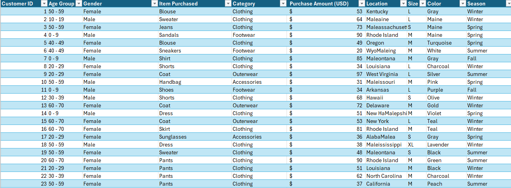
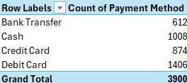
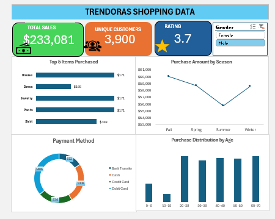

# Trendora Fashion : Retail Sales Performance & Consumer Behavior Analysis

​
## Executive Summary
A high-level overview of the 3,900 sample transactions and key performance indicators (KPIs).

## Business Context
Positioning you as a Junior Data Analyst at Trendora, a brand needing to understand online vs. in-store performance.

## Data Overview
Details on the demographics (Age, Gender) and transaction metrics (Purchase Amount, Season) used.

## Key Findings
Highlights of the Top 5 items and the most profitable seasons.

## Data Cleaning
Explains the "behind-the-scenes" work, such as standardizing text and grouping ages into 10-year buckets for better visualization.

## Detailed Analysis
Breaks down the specific PivotTable results for items and payment methods.

## Recommendations
Actionable business advice based on the data, such as inventory adjustments and targeted marketing.

## Tools Used
Showcases your proficiency in Microsoft Excel, specifically PivotTables, PivotCharts, and Slicers.

## Conclusion
​This report serves as a narrative companion to your Excel file, proving to recruiters that you can not only build a dashboard but also interpret the data to drive business value.
